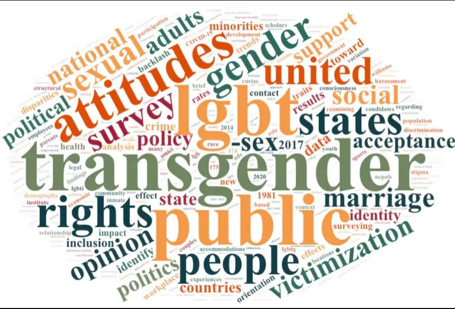

# 2024 

- Strode, Dakota, Tenaya Storm, and Andrew R. Flores. 2024. "[Transgender and Gender Diverse People Disproportionately Report Problems while Trying to Vote Than Cisgender People](https://www.journals.uchicago.edu/doi/abs/10.1086/732978?journalCode=jop)." *Journal of Politics*

- Flores, Andrew R., Dakota Strode, and Donald P. Haider-Markel. 2024. "[Political psychology and the study of LGBTQI+ groups, politics, and policy: Existing research and future directions](https://onlinelibrary.wiley.com/doi/abs/10.1111/pops.12989)." *Advances in Political Psychology*

- Flores, Andrew R. 2024. "Rainbow Voices: LGBTQ Respondents in the 2020 Collaborative Multiracial Postelection Survey." *PS: Political Science and Politics*

- Lefevor, G. Tyler, Sydney A. Sorrell, Kelsy Burke, and Andrew R. Flores. 2024. "[The Influence of Religious Affiliation on the Political Views of LGBT Americans](https://onlinelibrary.wiley.com/doi/abs/10.1111/jssr.12918)." *Journal for the Scientific Study of Religion* 63(3): 695-715.

- Lewis, Daniel C., Andrew R. Flores, Donald P. Haider-Markel, Patrick R. Miller, and Jami K. Taylor. 2024. "[Cultural Threat, Outgroup Empathy, and Attitudes toward Transgender Rights](https://link.springer.com/article/10.1007/s11109-024-09924-y)." *Political Behavior* 46: 2401-2426.

- Taylor, Jami K., Andrew R. Flores, Donald P. Haider-Markel, Daniel C. Lewis, Patrick R. Miller. 2024. "[American Federalism and Transgender Rights: A Blessing and a Curse](https://academic.oup.com/publius/article-abstract/54/3/511/7685299)." *Publius* 54(3): 511-533.

# 2023

- Flores, Andrew R., Daniel Boden, Donald P. Haider-Markel, Daniel C. Lewis, Patrick R. Miller, and Jami K. Taylor. 2024. "[Taking Perspective of the Stories We Tell about Transgender Rights](https://onlinelibrary.wiley.com/doi/abs/10.1111/psj.12475)." *Policy Studies Journal* 51(1): 123-143.
