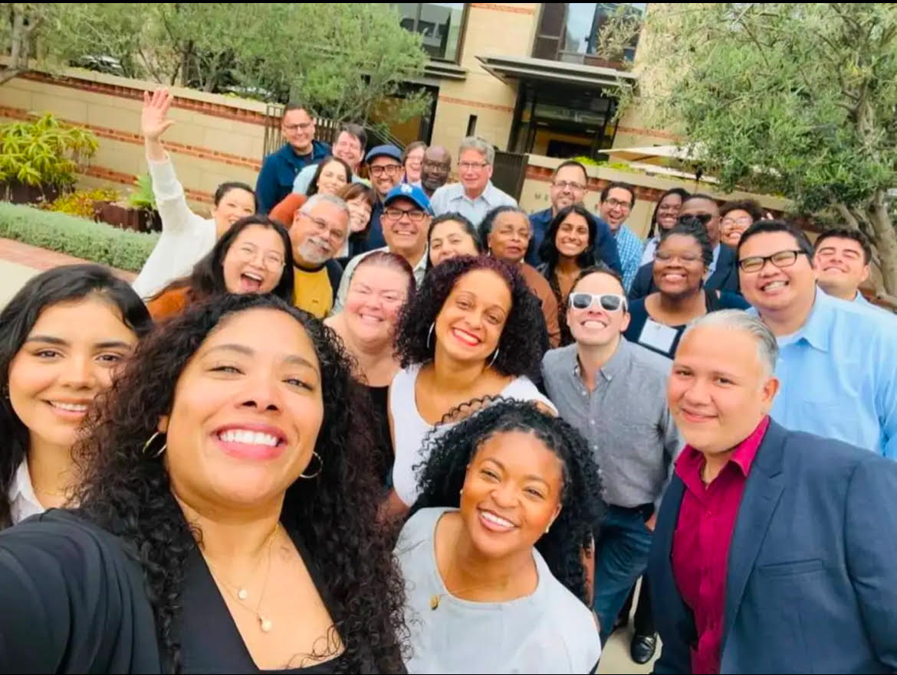

- GOVT 401: LGBTQ Politics & Policy (Fall 2024 [syllabus](GOVT 401 F24 FLORES.pdf))

- GOVT 650: Political Analysis (Fall 2024 [syllabus](GOVT 650 F4 FLORES.pdf))

- GOVT 653: Intro. to Quant. Methods in Political Science (Spring 2024 [syllabus](GOVT 653 S23 FLORES.pdf))

- GOVT 710: Seminar in Political Behavior (Spring 2022 [syllabus](GOVT 710 S22 FLORES.pdf))

- SPA 613: Conduct of Inquiry II (Spring 2024 [syllabus](SPA 613 S24 FLORES.pdf))
