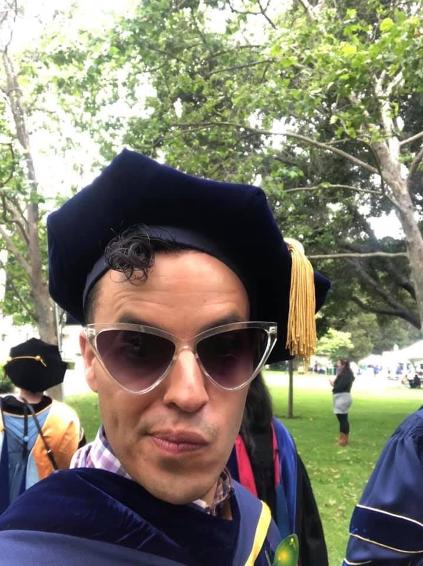

Greetings! I am Andrew R. Flores an Associate Professor at the [School of Public Affairs](https://www.american.edu/spa/) at American University and a Visiting Distinguished Scholar at the [Williams Institute](https://williamsinstitute.law.ucla.edu/) at the UCLA School of Law.  My research focuses on attitude formation, attitude change, and public policies affecting LGBTQ populations. You may find my works in Science Advances, the Proceedings of the National Academy of Sciences, Journal of Politics, the American Journal of Public Health, Policy Studies Journal, Political Behavior, Public Opinion Quarterly, Political Psychology, and other peer reviewed journals. I serve as an Associate Editor of [Political Research Quarterly](https://journals.sagepub.com/home/prq). I also served as a member of the National Academies of Sciences, Engineering, and Medicine [Consensus Committee](https://nap.nationalacademies.org/catalog/25877/understanding-the-well-being-of-lgbtqi-populations) on the Well-being of Sexual and Gender Diverse Populations in the US.

